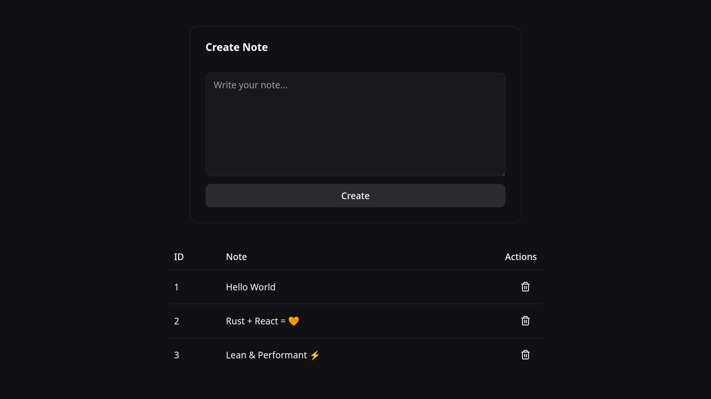

# Rusty React

**Rusty React** is a project template for building cross-platform applications that feature a web-based interface. It combines the power and safety of Rust for the backend with a React frontend.

The final output of this template is a standalone executable binary. This single binary acts as a web server, serving both the embedded React frontend and the backend API.

:warning: This template is still a work in progress :construction:

---

## Stack

#### Backend:

- [Axum](https://docs.rs/axum) (API & File Server)
- [SQLx](https://docs.rs/sqlx) (Async SQL toolkit)
- SQLite (via SQLx)
- [rust-embed](https://docs.rs/rust-embed) (Static asset embedding)

#### Frontend:

- [React](https://react.dev) (with [Tanstack Router](https://tanstack.com/router))
- [Tanstack Query](https://tanstack.com/query)
- [shadcn/ui](https://ui.shadcn.com)

---

## What’s Awesome

- **🔗 Single Binary Deployment**

  Bundle your entire application, frontend and backend, into one executable file. The React UI (inside the `ui` folder) is embedded directly into the Rust binary and served through `ui_handler`.

- **⚡ Fast and Memory Efficient**

  Built with Rust for performance, safety, and zero-cost abstractions. Ideal for servers, internal tools, and resource-constrained environments.

- **🦀 Memory Safety Without GC**

  Rust provides strong compile-time guarantees, eliminating entire classes of runtime bugs while keeping performance predictable.

- **🌐 Modern Web UI**

  Use React with shadcn/ui to create a dynamic, responsive, and professional user interface.

- **🛠️ Cross-Platform Support**

  Compile your app for Windows, macOS, and Linux from a single codebase.

- **🧳 Portable and Offline-Ready**

  Because the UI is embedded and served locally from the binary, your application works fully offline.

- **📦 Simple Distribution**

  Distribute your application as a single executable file. No Node.js runtime, no separate web server, no external static files.

- **🚀 Rapid Development**

  Use React’s development server during UI development, then build and embed automatically during `cargo build --release`.

---

## How It Works

1. The React app lives inside the `ui/` folder.
2. During release builds, `build.rs` runs `bun run build`.
3. The compiled `ui/dist` files are embedded into the Rust binary using `rust-embed`.
4. The `ui_handler` serves static assets and provides SPA fallback.
5. `/api/*` routes are handled by Axum.

Result: one binary that serves both API and UI.

---

## Development Workflow

### Backend

```bash
cargo run
```

### Frontend

```bash
cd ui
bun run dev
```

During development, the React dev server can proxy API requests to the Rust backend.

---

## Production Build

```bash
cargo build --release
./target/release/rusty-react
```

This will:

- Build the React app
- Embed the UI into the binary
- Produce a single deployable executable

No external runtime dependencies required.

---

## Why Rusty React?

Rusty React gives you the same deployment simplicity as Go-based single-binary templates, while leveraging Rust’s performance, safety guarantees, and ecosystem.

It is ideal for:

- Internal dashboards
- Desktop-style web apps
- Self-hosted tools
- Developer utilities
- Offline-capable applications

---


